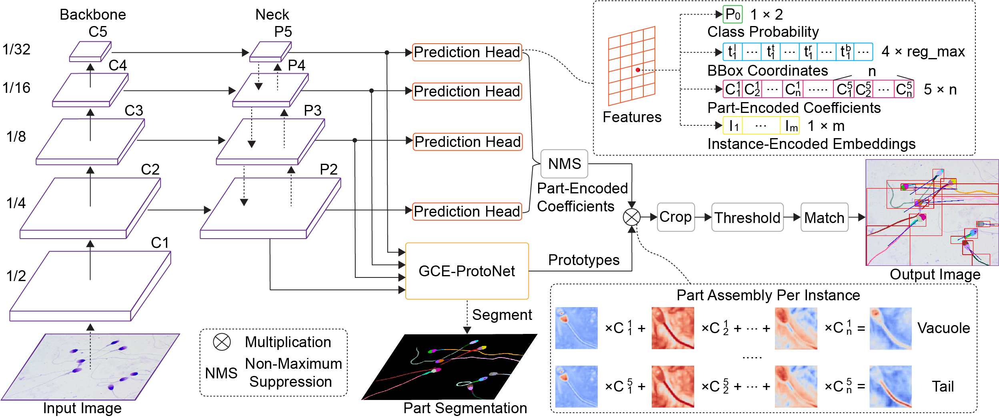
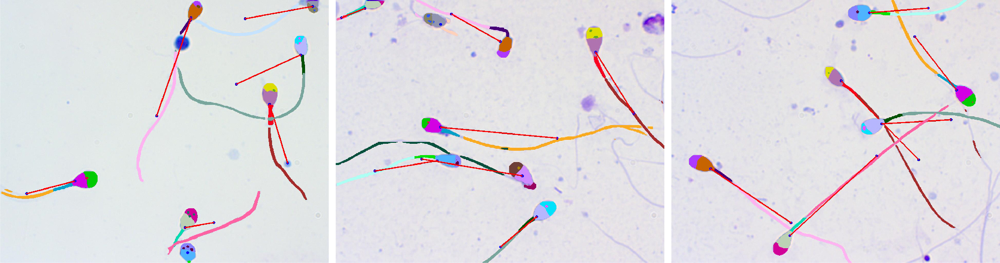

# CLPMnet
Official implementation of **Automated Sperm Morphology Analysis via Contrastive Learning-based Part Matching Network**

In this repository, we release the CLPMnet code in Pytorch and the proposed Sperm Parsing Dataset v2

## Netword architecture:
<p align="center"></p>

## Sample output:
<p align="center"></p>

## Dataset
The datasets are in ultralytics-github/datasets

## Installation
- basicsr.8.2.28
- pytorch.2.3.1

## Results and models
**On Sperm Parsing Dataset v2**

|Methods |    Backbone    | mIoU |Parsing (APp50/APvol/PCP50) | 
|--------|----------------|:----:|:--------------------------:| 
|CLPMnet |  CSPDarknet53  | 72.0 |      68.7/96.5/83.3        | 

## Evaluation
```
python predict_spermparsing_part_match.py
```
## Contact
Should you have any question, please contact chenwy.chen@mail.utoronto.ca

**Acknowledgment:** This code is based on the [ultralytics](https://github.com/ultralytics/ultralytics) toolbox